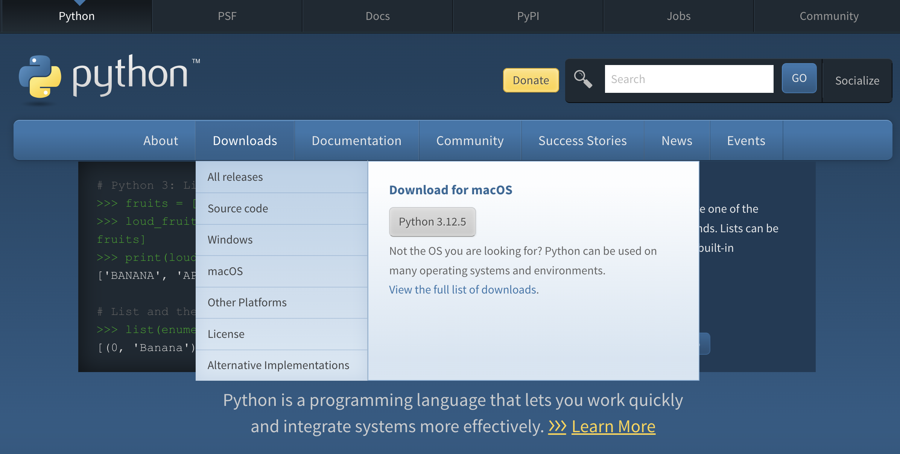
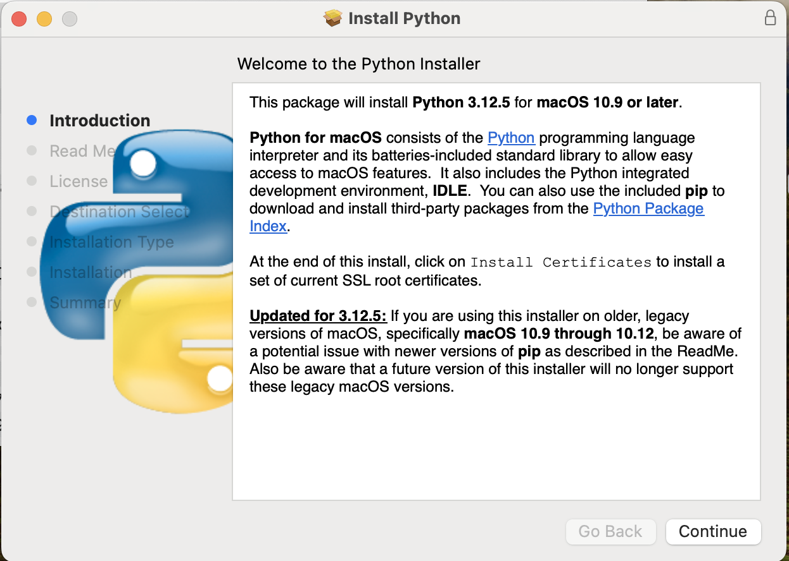
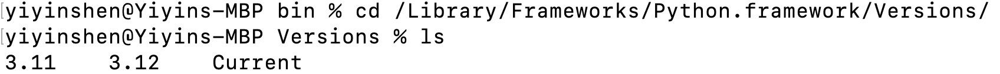
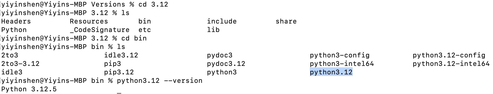

# Python Installation

This tutorial will go over how to install CPython on **Mac**. 

### Download CPython
Download CPython from the [official Python website](https://www.python.org/). As noted in the [documentation](https://docs.python.org/3/) (Fig 1), Python 3.12 is the latest stable version. Thus, you should download Python **3.12**, which is also the automatic recommendation on the download page (Fig 2).

<figure>
  
  <figcaption>Fig 1. Python 3 versions from documentation</figcaption>
</figure>

<figure>
  
  <figcaption>Fig 2. Python 3 download page</figcaption>
</figure>

### Install CPython
Click on the download .pkg file and follow the instructions to install CPython (Fig 3).

<figure>
  
  <figcaption>Fig 3. Python 3.12 installer</figcaption>
</figure>

Upon completing the installation, the directory containing the Python files, including the executable, is typically located in the `/Library/Frameworks/Python.framework/Versions/` directory. Use `cd /Library/Frameworks/Python.framework/Versions/` and then `ls` to list all previously installed Python versions. You will see that 3.12 is indeed in this folder (Fig 4), along with 3.11, which I had installed earlier.

<figure>
  
  <figcaption>Fig 4. Python 3.12 directory</figcaption>
</figure>

Once you `cd Python3.12/bin` and then `ls`, you will see the executable `python3.12` (Fig 5). You can also run `python3.12 --version` to verify that this executable can successfully be run.

<figure>
  
  <figcaption>Fig 5. Python 3.12 executable</figcaption>
</figure>

