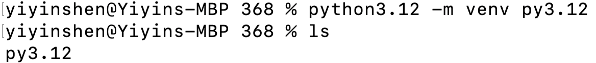
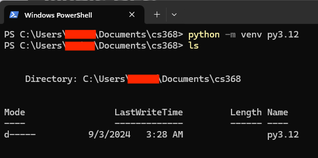
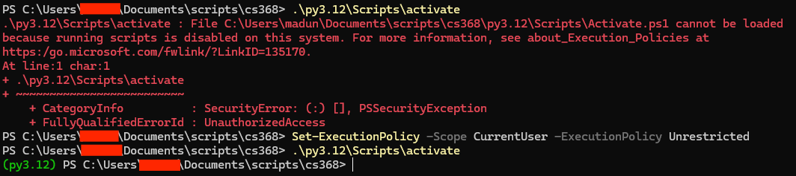

# Virtual Environments

This tutorial will go over how to create and then activate/deactivate a virtual environment.

### Creating Virtual Enviroment
There are many virtual environment management tools; we will use `venv` in this course, which is already included in the standard library upon installation. You're welcome to use other tools, such as Conda, pyenv, or virtualenv.

In your terminal ...

1. `cd` into a directory that you want to use for CS368 development.

2. Use `pwd` to make sure you're in the correct directory.

3. Create the virtual environment with the command in the format of: 

    ```<python path> -m venv <venv_name>``` 

    * Mac users need to use `python3.12`.
    * Windows users need to use `python`. 

    We'll use Python 3.12 for this course, and I'll name my virtual environment 'py3.12', so the filled-in command will be:

    * `python3.12 -m venv py3.12` for Mac
    * `python -m venv py3.12` for Windows

4. Once the virtual environment is created, you'll see a copy of Python 3.12 is created under your current directory (Fig 1 for Mac and Fig 2 for Windows).

<figure>
  
  <figcaption>Fig 1. Mac create venv</figcaption>
</figure>
<figure>
  
  <figcaption>Fig 2. Windows create venv</figcaption>
</figure>

### Activate/Deactivate Virtual Environment
You can activate your virtual environment with the command:
* ```source <venv_name>/bin/activate``` for Mac
* ```.\<venv_name>\Scripts\activate``` for Windows

My virtual environment is named 'py3.12', so the filled-in command will be:
* ```source py3.12/bin/activate``` for Mac
* ```.\py3.12\Scripts\activate``` for Windows

Once you enter a virtual environment, a `(venv_name)` will appear at the front of the command lines, indicating you're under this virtual environment (Fig 3 for Mac and Fig 4 for Windows).

<figure>
  
  <figcaption>Fig 3. Mac venv activate</figcaption>
</figure>
<figure>
  
  <figcaption>Fig 4. Windows venv activate</figcaption>
</figure>

Windows: if you encountered the following error after activated your venv, run `Set-ExecutionPolicy -Scope CurrentUser -ExecutionPolicy Unrestricted` to resolve.

You can simply run `deactivate` to exit the current virtual enviroment.