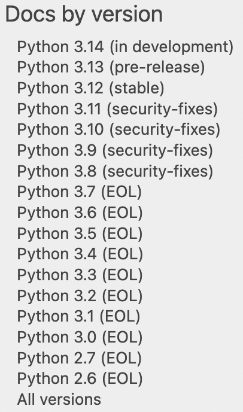
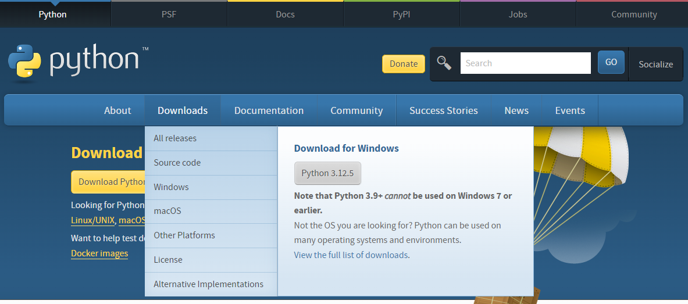
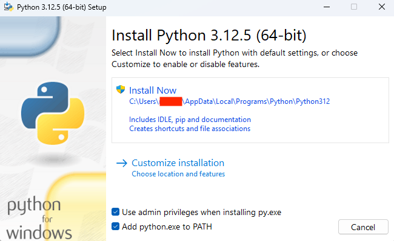
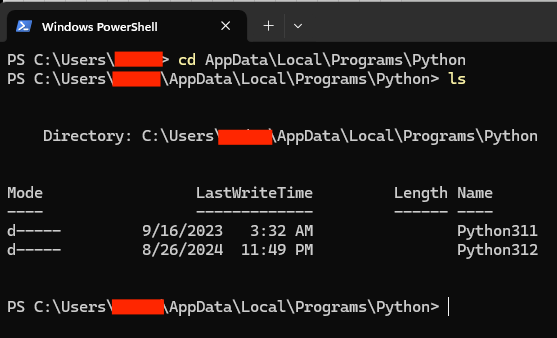
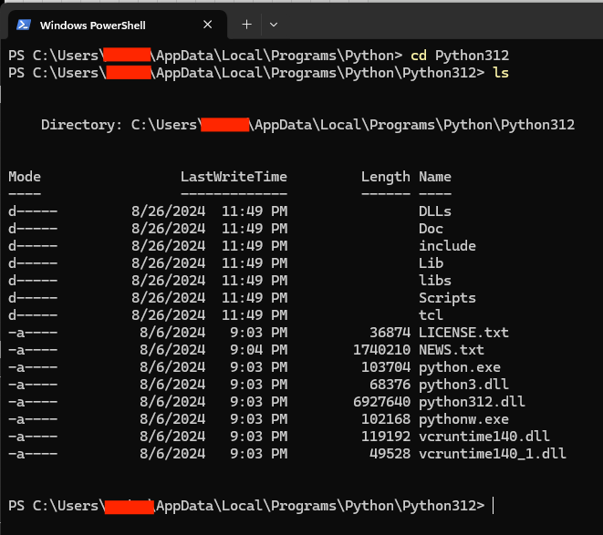

# Python Installation

This tutorial will go over how to install CPython on **Windows**. 

### Download CPython
Download CPython from the [official Python website](https://www.python.org/). As noted in the [documentation](https://docs.python.org/3/) (Fig 1), Python 3.12 is the latest stable version. Thus, you should download Python **3.12**, which is also the automatic recommendation on the download page (Fig 2).

<figure>
  
  <figcaption>Fig 1. Python 3 versions from documentation</figcaption>
</figure>

<figure>
  
  <figcaption>Fig 2. Python 3 download page</figcaption>
</figure>

### Install CPython
Click on the download .exe file and check the **add path.exe to PATH** box at the bottom (Fig 3). Then follow the instructions prompted to install CPython. 

<figure>
  
  <figcaption>Fig 3. Python 3.12 installer</figcaption>
</figure>

Upon completing the installation, the executable file that launches Python is typically located in the `AppData\Local\Programs` directory. This directory is commonly used for storing executables installed by the user. Running the commands cd `AppData\Local\Programs\Python` followed by `ls` in Windows PowerShell shows that the Python 3.12 directory is indeed inside `AppData\Local\Programs` (Fig 4). You can also see that I had also installed Python 3.11 before.

<figure>
  
  <figcaption>Fig 4. AppData\Local\Programs\Python folder </figcaption>
</figure>

Once you `cd Python312` and then `ls`, you’ll find that `python3.exe` is the executable that comes with the installation.

<figure>
  
  <figcaption>Fig 5. Python 3.12 executable</figcaption>
</figure>